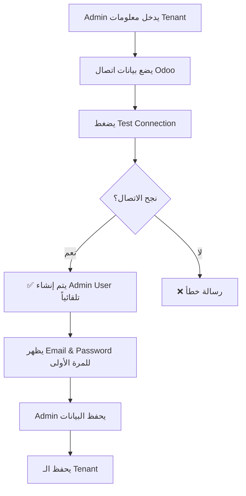
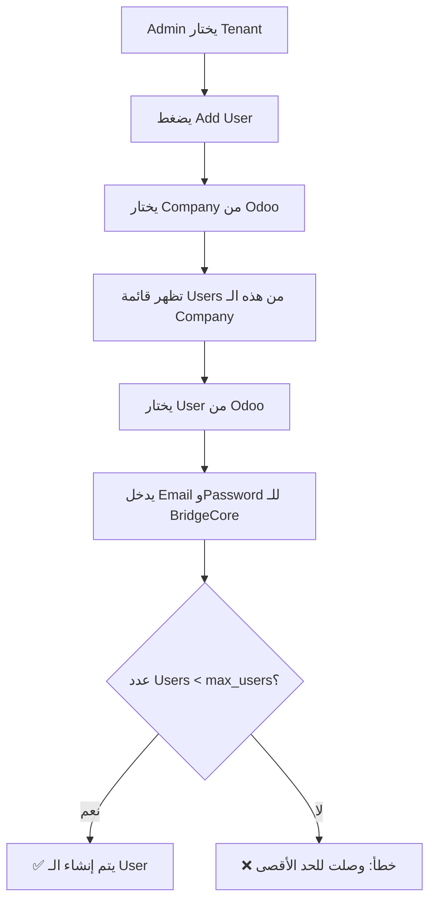

# 🔧 Tenant User Management - Major Fix

**تاريخ التحديث:** 22 نوفمبر 2025

## 🎯 المشكلة الجذرية

كان هناك خطأ جوهري في تصميم نظام إدارة المستخدمين:

### ❌ المشاكل القديمة:
1. **عند test connection ناجح** → لا يتم إنشاء user تلقائياً للأدمين
2. **عند إنشاء user جديد** → لا يوجد ربط مع Odoo users
3. **لا يوجد حد** لعدد المستخدمين المسموح بهم لكل tenant

---

## ✅ الحل المطبق

### 1️⃣ إضافة حقل `max_users` في Tenants

**التغيير في Model:**
```python
# app/models/tenant.py
max_users = Column(Integer, nullable=False, default=5)
```

**Migration:**
- ✅ تم إنشاء migration `003_add_max_users_field.py`
- ✅ القيمة الافتراضية: 5 مستخدمين
- ✅ يمكن تعديلها لكل tenant حسب الخطة

---

### 2️⃣ إنشاء Admin User تلقائياً عند Test Connection

**التغيير في `tenant_service.py`:**

عند نجاح test connection، يتم:
1. ✅ التحقق من وجود مستخدمين للـ tenant
2. ✅ إذا لم يوجد → إنشاء admin user تلقائياً
3. ✅ ربط الـ user مع Odoo user ID
4. ✅ إرجاع email وpassword للمرة الأولى فقط

**Response الجديد:**
```json
{
  "success": true,
  "message": "Connection successful...",
  "version": "18.0",
  "user_info": { ... },
  "admin_user_created": true,
  "admin_email": "admin@done-distribution.local",
  "admin_password": "xyz123abc456..."
}
```

---

### 3️⃣ Endpoints جديدة لجلب Companies و Users من Odoo

#### 📡 Get Companies
```
GET /admin/odoo-helpers/companies/{tenant_id}
```

**Response:**
```json
{
  "success": true,
  "companies": [
    {
      "id": 1,
      "name": "My Company"
    },
    {
      "id": 2,
      "name": "Branch Office"
    }
  ]
}
```

#### 📡 Get Users by Company
```
GET /admin/odoo-helpers/users/{tenant_id}?company_id=1
```

**Response:**
```json
{
  "success": true,
  "users": [
    {
      "id": 2,
      "name": "Administrator",
      "login": "admin",
      "email": "admin@example.com",
      "company_id": 1
    },
    {
      "id": 5,
      "name": "John Doe",
      "login": "john",
      "email": "john@example.com",
      "company_id": 1
    }
  ]
}
```

---

### 4️⃣ التحقق من max_users عند إنشاء User

**التغيير في `tenant_users.py`:**

```python
# Check max_users limit
current_users_count = len(result.scalars().all())

if current_users_count >= tenant.max_users:
    raise HTTPException(
        status_code=status.HTTP_400_BAD_REQUEST,
        detail=f"Maximum number of users ({tenant.max_users}) reached"
    )
```

**Error Response:**
```json
{
  "detail": "Maximum number of users (5) reached for this tenant"
}
```

---

## 🔄 سير العمل الجديد

### السيناريو 1: إنشاء Tenant جديد



### السيناريو 2: إضافة User جديد



---

## 📊 التغييرات في Database

### جدول `tenants`
```sql
ALTER TABLE tenants ADD COLUMN max_users INTEGER NOT NULL DEFAULT 5;
```

### جدول `tenant_users`
- لم يتغير البنية
- لكن الآن `odoo_user_id` مهم جداً للربط

---

## 🎨 التغييرات المطلوبة في Admin Dashboard

### 1. صفحة Create Tenant

**إضافة حقل:**
```tsx
<Form.Item 
  name="max_users" 
  label="Maximum Users" 
  initialValue={5}
  rules={[{ required: true, type: 'number', min: 1, max: 1000 }]}
>
  <InputNumber min={1} max={1000} />
</Form.Item>
```

**عرض نتيجة Test Connection:**
```tsx
{testResult?.admin_user_created && (
  <Alert
    type="success"
    message="Admin User Created"
    description={
      <div>
        <p><strong>Email:</strong> {testResult.admin_email}</p>
        <p><strong>Password:</strong> {testResult.admin_password}</p>
        <p className="text-red-500">⚠️ Save these credentials! They won't be shown again.</p>
      </div>
    }
  />
)}
```

### 2. صفحة Create Tenant User

**خطوات جديدة:**

```tsx
// Step 1: Select Company
<Select
  placeholder="Select Odoo Company"
  onChange={handleCompanyChange}
  loading={loadingCompanies}
>
  {companies.map(company => (
    <Select.Option key={company.id} value={company.id}>
      {company.name}
    </Select.Option>
  ))}
</Select>

// Step 2: Select Odoo User
<Select
  placeholder="Select Odoo User"
  onChange={handleOdooUserChange}
  loading={loadingUsers}
  disabled={!selectedCompany}
>
  {odooUsers.map(user => (
    <Select.Option key={user.id} value={user.id}>
      {user.name} ({user.login})
    </Select.Option>
  ))}
</Select>

// Step 3: Enter BridgeCore credentials
<Form.Item name="email" label="BridgeCore Email">
  <Input type="email" />
</Form.Item>

<Form.Item name="password" label="BridgeCore Password">
  <Input.Password />
</Form.Item>
```

**عرض عدد المستخدمين:**
```tsx
<Alert
  type="info"
  message={`Users: ${currentUsersCount} / ${tenant.max_users}`}
  description={
    currentUsersCount >= tenant.max_users 
      ? "⚠️ Maximum users reached. Please upgrade your plan."
      : `You can add ${tenant.max_users - currentUsersCount} more user(s).`
  }
/>
```

### 3. صفحة Edit Tenant

**إضافة حقل max_users:**
```tsx
<Form.Item 
  name="max_users" 
  label="Maximum Users"
  rules={[{ required: true, type: 'number', min: 1, max: 1000 }]}
>
  <InputNumber min={1} max={1000} />
</Form.Item>
```

---

## 🔌 API Calls للـ Frontend

### جلب Companies
```typescript
const getOdooCompanies = async (tenantId: string) => {
  const response = await fetch(
    `/admin/odoo-helpers/companies/${tenantId}`,
    {
      headers: {
        'Authorization': `Bearer ${adminToken}`
      }
    }
  );
  return await response.json();
};
```

### جلب Users
```typescript
const getOdooUsers = async (tenantId: string, companyId: number) => {
  const response = await fetch(
    `/admin/odoo-helpers/users/${tenantId}?company_id=${companyId}`,
    {
      headers: {
        'Authorization': `Bearer ${adminToken}`
      }
    }
  );
  return await response.json();
};
```

### إنشاء User مع Odoo User ID
```typescript
const createTenantUser = async (userData: {
  tenant_id: string;
  email: string;
  password: string;
  full_name: string;
  role: string;
  odoo_user_id: number;
}) => {
  const response = await fetch('/admin/tenant-users', {
    method: 'POST',
    headers: {
      'Content-Type': 'application/json',
      'Authorization': `Bearer ${adminToken}`
    },
    body: JSON.stringify(userData)
  });
  
  if (!response.ok) {
    const error = await response.json();
    if (error.detail.includes('Maximum number of users')) {
      throw new Error('MAX_USERS_REACHED');
    }
    throw new Error(error.detail);
  }
  
  return await response.json();
};
```

---

## ✅ الفوائد

### للـ Admin:
1. ✅ **توفير وقت**: لا حاجة لإنشاء admin user يدوياً
2. ✅ **ربط تلقائي**: كل user مربوط بـ Odoo user
3. ✅ **تحكم أفضل**: حد أقصى للمستخدمين حسب الخطة

### للـ Tenant:
1. ✅ **سهولة البدء**: admin user جاهز مباشرة
2. ✅ **تنظيم أفضل**: كل user مربوط بـ company محددة
3. ✅ **أمان أكبر**: لا يمكن تجاوز الحد المسموح

### للنظام:
1. ✅ **consistency**: كل tenant له admin user
2. ✅ **scalability**: التحكم في عدد المستخدمين
3. ✅ **traceability**: ربط واضح مع Odoo

---

## 🧪 الاختبار

### Test 1: إنشاء Tenant جديد
```bash
# 1. Create tenant
curl -X POST https://bridgecore.geniura.com/admin/tenants \
  -H "Authorization: Bearer $ADMIN_TOKEN" \
  -H "Content-Type: application/json" \
  -d '{
    "name": "Test Company",
    "slug": "test-company",
    "contact_email": "test@company.com",
    "odoo_url": "https://odoo.company.com",
    "odoo_database": "test_db",
    "odoo_username": "admin",
    "odoo_password": "admin123",
    "plan_id": "...",
    "max_users": 10
  }'

# 2. Test connection
curl -X POST https://bridgecore.geniura.com/admin/tenants/{tenant_id}/test-connection \
  -H "Authorization: Bearer $ADMIN_TOKEN"

# Expected: admin_user_created = true
```

### Test 2: جلب Companies
```bash
curl -X GET https://bridgecore.geniura.com/admin/odoo-helpers/companies/{tenant_id} \
  -H "Authorization: Bearer $ADMIN_TOKEN"
```

### Test 3: جلب Users
```bash
curl -X GET "https://bridgecore.geniura.com/admin/odoo-helpers/users/{tenant_id}?company_id=1" \
  -H "Authorization: Bearer $ADMIN_TOKEN"
```

### Test 4: التحقق من max_users
```bash
# Try to create user when limit reached
curl -X POST https://bridgecore.geniura.com/admin/tenant-users \
  -H "Authorization: Bearer $ADMIN_TOKEN" \
  -H "Content-Type: application/json" \
  -d '{
    "tenant_id": "...",
    "email": "user@test.com",
    "password": "password123",
    "full_name": "Test User",
    "role": "user",
    "odoo_user_id": 5
  }'

# Expected: Error if max_users reached
```

---

## 📝 ملاحظات مهمة

### ⚠️ Breaking Changes:
1. **Schema تغير**: `TenantCreate` و `TenantUpdate` الآن يحتويان على `max_users`
2. **Response تغير**: `test_connection` الآن يرجع `admin_user_created` و `admin_password`
3. **Validation جديد**: `create_tenant_user` الآن يتحقق من `max_users`

### 🔒 أمان:
1. **Password يظهر مرة واحدة فقط** عند إنشاء admin user
2. **Admin فقط** يمكنه الوصول لـ odoo-helpers endpoints
3. **Validation صارم** على max_users (1-1000)

### 🎯 TODO للـ Frontend:
- [ ] إضافة حقل max_users في Create/Edit Tenant
- [ ] إضافة عرض credentials عند test connection ناجح
- [ ] إضافة select companies في Create User
- [ ] إضافة select odoo users في Create User
- [ ] إضافة عرض users count vs max_users
- [ ] إضافة معالجة خطأ MAX_USERS_REACHED

---

**آخر تحديث:** 22 نوفمبر 2025

